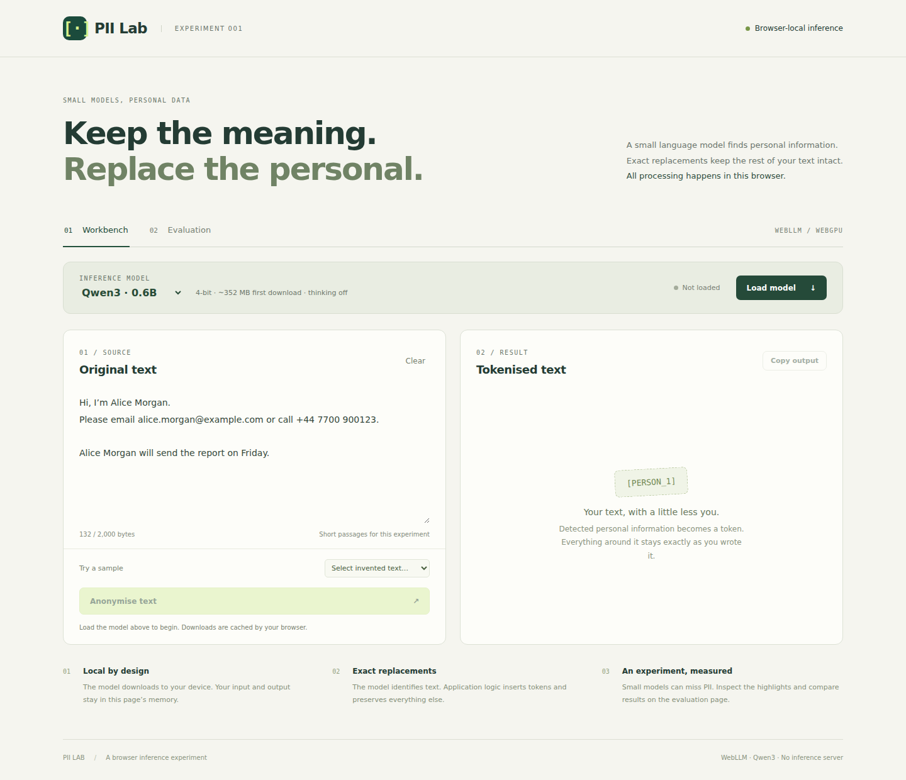

# PII Lab

A desktop browser experiment: use a small local language model to detect personal information, then replace exact spans with tokens while preserving the rest of the text.

The first implementation uses **WebLLM + Qwen3-0.6B**. A Qwen3-1.7B option allows a deliberate comparison when the smaller model misses information. This is an experimental detector, not a guarantee that all identifying information has been removed.



## Run locally

Requirements: Node.js 22.12+ (Node 24 recommended), npm, and a desktop browser with WebGPU. Start with current Chrome or Edge and graphics acceleration enabled. If the GPU lacks `shader-f16`, the app selects the same model's `q4f32_1` export and displays “compatibility mode”. This can consume more memory and run slower; it does not switch to a larger model or a remote service.

```sh
npm ci
npm run dev
```

Open <http://127.0.0.1:5173>. No API key, environment file, or inference backend is needed.

1. Choose a model and click **Load model**. The first visit downloads its weights and runtime.
2. Paste a short passage or select an invented sample.
3. Click **Anonymise text** and review the highlighted detections and tokenised output.
4. Use **Evaluation** to run five labelled examples sequentially and export a JSON report.
5. Unload before selecting another model. **Cancel & unload** also stops unfinished work.

Use **Inspect model response** after a completed attempt to see the exact response text, finish reason, runtime model, output-token count, and elapsed time. This works for invalid JSON and unfinished responses as well as successful detections. Raw responses are sensitive, unvalidated text, displayed literally in a collapsed panel. Workbench responses are kept only in page memory, cleared on input/model changes or another attempt, and never included in evaluation exports. Completed validation failures leave the model loaded for retry; timeouts and runtime failures unload it. If no response arrived, there is no raw content to display.

Each evaluation case has its own response inspector. A completed response that fails JSON or exact-span validation is recorded without anonymised output, and evaluation continues to the next fixture. While inference is active, the evaluation panel identifies the case currently running and counts every processed case, including failures. A runtime failure or timeout stops the run and unloads the model because the underlying generation may still be active. Evaluation exports include only the invented fixtures and their responses, including failed cases, so the experiment can be diagnosed without exporting workbench text.

The initial limit is **2,000 UTF-8 bytes per passage**, with a 4,096-token model context and at most 1,024 output tokens. This deliberately keeps the experiment focused on short passages. UTF-8 bytes are not model tokens; engine context errors are reported rather than silently truncating documents.

## What runs where

```text
Original text → WebLLM in a browser worker → exact strings + categories
             → validate against original → deterministic token replacement
```

- React/TypeScript renders the app; Vite serves and builds it.
- WebLLM runs the model on the browser's GPU, inside a dedicated worker.
- Model code loads only after clicking **Load model**.
- Input, output, and token mappings stay in page memory. Reloading clears them.
- No analytics, remote fonts, inference API, or automatic text logging is included.
- Initial downloads contact Hugging Face and the WebLLM runtime host. Those requests reveal normal network metadata, but do not contain the text being processed.
- Model assets are cached by WebLLM in browser storage. Cache eviction/private browsing can cause another download. This app does not promise a fully offline page reload.
- One model runs at a time within the app tab. Idle unload asks WebLLM to release its GPU resources, then terminates its worker (with a two-second fallback deadline). Controls stay locked until cleanup finishes. Cancellation and page exit terminate immediately; cached files remain on disk. Opening multiple tabs can allocate multiple models.

## When WebGPU stops working

“No WebGPU adapter is available” means the browser exposes the API but cannot supply a usable GPU before model loading starts. If it worked earlier, save any text you need, close other model tabs, and fully quit and reopen the browser. Reload the app and explicitly load 0.6B first. You do not need to delete cached model downloads.

If it persists, check that graphics acceleration is enabled in the browser's system settings, then inspect `chrome://gpu` (Chrome) or `edge://gpu` (Edge), especially WebGPU status and “Problems Detected”. Record your browser version, OS, GPU, and whether restarting restored access. [Chrome's WebGPU troubleshooting guide](https://developer.chrome.com/docs/web-platform/webgpu/troubleshooting-tips) lists causes including disabled acceleration, GPU blocklisting, and repeated GPU-process crashes. The app cannot establish which one happened from a null adapter alone.

## Models and sizes

| Model ID                 | Approximate MLC model download |
| ------------------------ | -----------------------------: |
| `Qwen3-0.6B-q4f16_1-MLC` |                         352 MB |
| `Qwen3-1.7B-q4f16_1-MLC` |                         984 MB |

The compiled runtime is an additional download. Running memory and loading peaks exceed download size and depend on browser, GPU, context, and runtime. Sizes are from the [0.6B](https://huggingface.co/mlc-ai/Qwen3-0.6B-q4f16_1-MLC/tree/main) and [1.7B](https://huggingface.co/mlc-ai/Qwen3-1.7B-q4f16_1-MLC/tree/main) repositories, checked on 2026-09-10.

Thinking is disabled. Generation uses temperature zero and schema-constrained JSON. That constrains the response shape; it does not guarantee correct detections or identical output across hardware. The application package and lockfile pin the runtime. Upstream model URLs currently follow their repositories' default revisions, so record the date of comparisons; bit-for-bit model reproducibility would additionally require pinning model revisions/assets.

The pinned WebLLM 0.2.82 runtime includes an exact empty thinking prefix (`<think>\n\n</think>\n\n`) in returned content when thinking is disabled. The adapter removes only that prefix before strict JSON validation. The response inspector retains it verbatim. Other reasoning, Markdown wrappers, malformed JSON, and truncated responses remain errors.

WebLLM is intentionally pinned to 0.2.82. An [upstream GPU-cache regression](https://github.com/mlc-ai/web-llm/issues/844) introduced in 0.2.83 can dispose GPU shape objects while they are still in use, causing longer Qwen3 prefills to fail and sometimes lose the WebGPU device. The same faulty eviction code remains present in 0.2.85, which this experiment briefly used. Revisit the pin after the upstream fix is released and verified against this evaluation.

## Exact preservation and matching policy

The LLM never writes the final document. It returns source strings labelled as `PERSON`, `EMAIL`, `PHONE`, `ADDRESS`, `DATE_OF_BIRTH`, `ID`, or `ACCOUNT`. Application logic:

- Finds exact, case-sensitive occurrences with Unicode letter/number/mark boundaries.
- Replaces every matching occurrence of a detected literal. An identical literal and category reuse the same token within that document.
- Gives complete containing spans precedence, such as a full name over its parts.
- Rejects unmatched strings, conflicting categories, malformed output, truncated generations, and partially overlapping spans. Failed runs produce no output.
- Avoids generated tokens that already occur in the original text.
- Copies every character outside replacement spans directly from the original string, including whitespace, punctuation, and line breaks.

This version does not resolve aliases, distinguish two people with the same name, or selectively redact only one occurrence of an ambiguous literal. For example, detecting “May” as a name could also replace a separate whole-word occurrence referring to the month. Full anonymisation of indirect identifying context is outside this first milestone. Keeping a token mapping makes the transformation reversible; treat that mapping as sensitive too.

## Validation

```sh
npm run check          # formatting, typecheck, production build, unit tests
npx playwright install chromium
npm run test:e2e       # UI tests with an explicitly simulated detector
npm run eval:model     # REAL model: opens Chromium, runs fixtures, saves a report
```

`test:e2e` does not establish model accuracy. It intercepts the detector module in the dev server only; no simulated engine is shipped in the app.

`eval:model` (also available as `test:model`) starts the development server itself and requires a usable GPU and a display by default. It uses `.model-cache/` as a persistent Chromium profile so model downloads survive later runs, and saves timestamped reports under `model-evaluation-results/`. This profile is separate from normal Chrome, so its first run may download the model again. Both directories are ignored by Git. The runner prints aggregate counts without printing fixture text or model responses and saves its report before finishing. Misses, extra detections, and incomplete cases are experimental results, so they do not fail the command by default. Set `MODEL_STRICT=1` when you specifically want a zero-miss, zero-extra regression gate. Even a strict pass applies only to this small diagnostic set; it does not establish that a model is safe for general PII anonymisation.

Run 0.6B once, or repeat it three times to inspect stability:

```sh
npm run eval:model
npm run eval:model -- --repeat-each=3
```

To select the larger model in Bash:

```sh
MODEL_ID=Qwen3-1.7B-q4f16_1-MLC npm run eval:model
```

In Windows PowerShell:

```powershell
$env:MODEL_ID = 'Qwen3-1.7B-q4f16_1-MLC'
npm run eval:model
Remove-Item Env:MODEL_ID
```

Optional runner settings: `MODEL_STRICT=1` enables the strict quality gate; `PLAYWRIGHT_CHROMIUM_EXECUTABLE_PATH` selects an existing Chromium executable; `MODEL_PROFILE_DIR` and `MODEL_REPORT_DIR` change the persistent profile and report locations; `MODEL_HEADLESS=1` runs headless; `MODEL_SOFTWARE_GPU=1` enables an experimental SwiftShader path. Software GPU timings are not representative of desktop GPU performance. Do not commit the browser profile, model weights, or unreviewed reports.

Evaluation checks exact span and category matches, including repeated occurrences. It reports correct, missed, and extra detections. Completed validation failures remain failures and produce no partial output, but do not prevent later fixtures from running. Runtime failures stop the run. Five invented cases are a diagnostic set, not an accuracy benchmark. See the [experiment journal](docs/experiment-journal.md) for actual validation status and findings.

**Current real-model status:** A Windows desktop run of Qwen3-0.6B with prompt v2 scored 8/11 correct spans with 3 missed and 16 extra. See the [reviewed 0.6B result](docs/evidence/2026-09-11-qwen3-0.6b-prompt-v2.json). After the WebLLM rollback, Qwen3-1.7B completed all five inference calls. Its reviewed raw detections scored 9/11 correct with 2 missed and 8 extra, but exact-span validation rejected one complete document. The anonymised output actually published across the fixtures contained only 6/11 correct replacements, with 5 missed and 6 extra. See the [reviewed 1.7B result](docs/evidence/2026-09-11-qwen3-1.7b-prompt-v2-webllm-0.2.82.json). The larger model performed better on this small diagnostic set but remains unsuitable for unattended anonymisation. Software-WebGPU runs are recorded separately for [0.6B](docs/evidence/2026-09-10-software-gpu.json) and [1.7B](docs/evidence/2026-09-11-qwen3-1.7b-software-gpu.json); both timed out and are not representative of desktop GPU performance.

## Production build

```sh
npm run build
npm run preview
```

Serve `dist/` on an HTTPS static host. Page navigation uses hashes, so no server route rewrites are required. The initial bundle excludes the lazily loaded WebLLM engine; the build reports large engine chunks because the inference runtime includes compiled code. GPU inference requires HTTPS or localhost. This first WebGPU implementation does not need the cross-origin-isolation headers that some multithreaded WASM approaches require.

## Repository map

| Location                     | Purpose                                                               |
| ---------------------------- | --------------------------------------------------------------------- |
| `src/core/`                  | Pure span replacement, output validation, fixtures, and scoring       |
| `src/inference/`             | Detector interface, prompt, model settings, WebLLM adapter and worker |
| `src/App.tsx`                | Model lifecycle controls, workbench, and evaluation UI                |
| `tests/browser/`             | Browser workflows with simulated inference                            |
| `tests/model/`               | Opt-in real model evaluation                                          |
| `docs/experiment-journal.md` | Decisions, progress, evidence, and article material                   |

For contribution expectations see [CONTRIBUTING.md](CONTRIBUTING.md). Coding agents should read [AGENTS.md](AGENTS.md). The next runtime can implement `Detector` while reusing the same replacement logic and fixture scoring.

## Publication and licensing

An application source license has not yet been selected by the project owner. Choose one before advertising this repository as open source. Dependency and model licenses remain separate; the Qwen3 model cards identify Apache-2.0. No model weights are committed here.
